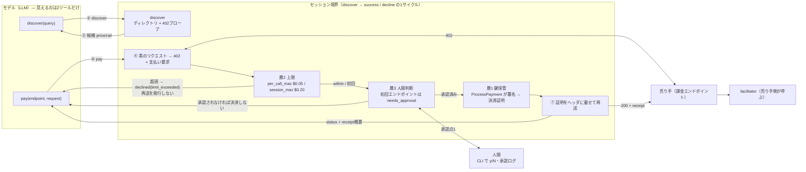

# T8: セッション境界と人間承認2点

図（1枚）: [`session-boundary.svg`](./session-boundary.svg)

編集用の同じ内容:

## 図に書いてあることの根拠

| 図の主張 | 根拠 |
|---|---|
| モデルに見えるツールは2つだけ | `src/agent/tools.ts` の `TOOL_DEFS`（長さ2をコードで assert）。`npm run check:tools` が機械検査 |
| 上限超過で再送が発生しない | `artifacts/limit-exceeded/events.jsonl` に `pay.declined {retry_sent:false}` があり、`http.request` の retry フェーズが1件も無い |
| 承認前に決済に進まない | `artifacts/not-approved` `artifacts/cli-approval-denied` — どちらも `approval.decision {approved:false}` の後に署名も再送も無い |
| 鍵がセッションをまたがない | `closeSession()` が `finally` で必ず走る（`src/cli.ts`）。local-signer は `#account = undefined`、AgentCore は `DeletePaymentSession` |
| AgentCore は証明までしか返さない | `PaymentStatus` enum が `PROOF_GENERATED` のみ（`docs/T1-agentcore-findings.md` §4） |

## 承認点が2つで足りている理由と、足りていない可能性

指示書どおり、承認を残したのは「初回エンドポイント」と「上限超過」の2点。
1セッション回してみて、この2点で拾えないものが2つ見えた。記録として残す。

1. **同一オリジンの別リソース**。初回判定はオリジン単位（`originOf()`）なので、
   `/x402/weather` を承認すると同じホストの `/x402/premium` は「初回」ではなくなる。
   金額が per_call_max 以内なら承認なしで通る。今回は上限が効くので実害は出ないが、
   「オリジン単位で信頼を与える」という判断を人間がしていることになる。
   パス単位にすると承認回数が増える。**どちらが正しいかは決めていない。**

2. **累計が上限に近づいたとき**。session_max の 8 割を超えたあたりで一度止める、
   という承認点は置いていない。今回は decline か success の二択なので、
   「気づいたら使い切っていた」は起こりうる。
