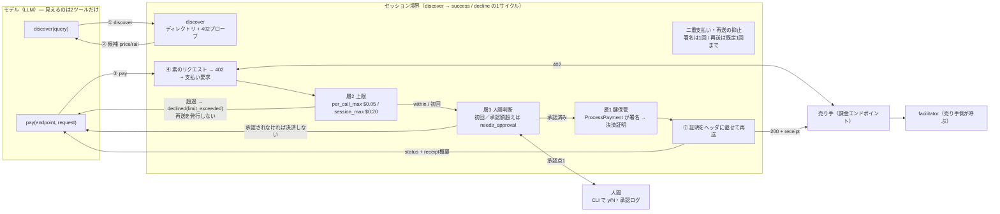

# T8: セッション境界と人間承認2点

図（1枚）: [`session-boundary.svg`](./session-boundary.svg)

編集用の同じ内容:



## 図に書いてあることの根拠

| 図の主張 | 根拠 |
|---|---|
| モデルに見えるツールは2つだけ | `src/agent/tools.ts` の `TOOL_DEFS`（長さ2をコードで assert）。`npm run check:tools` が機械検査 |
| 上限超過で再送が発生しない | `artifacts/limit-exceeded/events.jsonl` に `pay.declined {retry_sent:false}` があり、`http.request` の retry フェーズが1件も無い |
| 承認前に決済に進まない | `artifacts/not-approved` `artifacts/cli-approval-denied` — どちらも `approval.decision {approved:false}` の後に署名も再送も無い |
| 上限超過時に署名も走らない | `pay.declined {process_payment_called:false}`。`per_call_max` と `session_max` は `rule` で区別される（`artifacts/per-call-only` は session に余裕がある状態で per_call だけで落ちる） |
| 承認に金額の天井がある | `artifacts/grant-scope-exceeded` — $0.01 承認後、同一オリジンの $0.03 で再度承認を求めて否認 → decline |
| 402 が返り続けても再署名しない | `artifacts/merchant-rejects` — `pay.proof` は 1 件、`pay.resend_rejected` で終了 |
| 売り手側の検証が本物 | `npm run check:facilitator` — nonce 再利用・署名改竄・MPP チャレンジ書き換え・nonce 未束縛をすべて 402 で弾き、正しい支払いだけ 200 |
| 鍵がセッションをまたがない | `closeSession()` が `finally` で必ず走る（`src/cli.ts`）。local-signer は `#account = undefined`、AgentCore は `DeletePaymentSession` |
| AgentCore は証明までしか返さない | `PaymentStatus` enum が `PROOF_GENERATED` のみ（`docs/T1-agentcore-findings.md` §4） |

## 承認点が2つで足りている理由と、まだ足りていないところ

指示書どおり、承認を残したのは「初回エンドポイント」と「上限超過」の2点。
最初に回したとき、この2点で拾えない穴が2つ見えた。片方は塞いだ。

### 塞いだ: 同一オリジンの別リソース（2026-08-25）

初回判定がオリジン単位だったので、`/x402/weather` を承認すると
同じホストの `/x402/premium` は「初回」ではなくなり、per_call_max 以内なら
承認なしで通っていた。**一度払ったオリジンを無条件に信用していた。**

`src/guard/approvalLedger.ts` を入れて、承認に**金額の天井**を付けた。
人間が $0.01 を承認したなら、同じオリジンでもそれを超える請求はもう一度聞く。

```
approval.point {"name":"承認済み金額を超える支払い","endpoint":".../x402/standard",
                "approved":false,"amount_usd":"0.030000",
                "previous_scope":"http://127.0.0.1:8402 まで 0.010000 USD/回（今セッション内）"}
pay.declined   {"reason":"not_approved","retry_sent":false,"process_payment_called":false}
```

採取: `artifacts/grant-scope-exceeded`。承認範囲は receipt にも入る（`approval.scope`）。

パス単位まで細かくすると承認回数が増える。オリジン＋金額の天井、が今の落としどころ。

### 塞いでいない: 累計が上限に近づいたときの承認点

session_max の 8 割を超えたあたりで一度止める、という承認点は置いていない。
今も decline か success の二択なので、「気づいたら使い切っていた」は起こりうる。
**これは意図的に未実装。** 止める閾値を決める根拠が無いまま入れると、
承認疲れを増やすだけになる。

## 二重支払いと再送の抑止（2026-08-25 追加）

層1（署名）と再送のあいだにもう 1 枚入っている（`src/guard/demandLedger.ts`）。

- ProcessPayment は demand ごとに固定した `clientToken` で叩く
  → AgentCore 側の冪等性に載る
- 1 回の `pay()` につき ProcessPayment は 1 回まで → こちら側でも二重署名を止める
- 再送は既定 1 回まで。**402 で返されたら署名し直さない**
  （`artifacts/merchant-rejects`。ログに `pay.proof` が 1 件しか無いことで確認できる）
- 経済的に同一の請求がセッション内で複数回成立したら
  `guard.duplicate.session_repeat` を残す（同じ商品の再購入は正当なので止めはしない）

「リトライは親切」ではなく「リトライは支出」という向きの設計にしてある。
